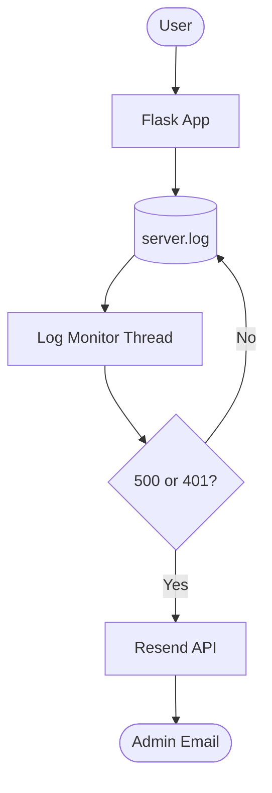

#  AI Real-Time Logs Analyzer

[](https://render.com)

A production-grade, real-time log monitoring and alerting system built with **Python**, **Flask**, and **Resend**. This tool scans your server logs in real-time and sends instant email alerts for critical errors or security threats, complete with **full stack tracebacks**.

---

##  The Problem It Solves

Traditional log monitoring often feels like looking for a needle in a haystack. By the time you find a server error, your users have already been affected. 

**AI Real-Time Logs Analyzer** solves this by:
- **Instant Awareness**: Detects 500 (Server Error) and 401 (Unauthorized) status codes the millisecond they are logged.
- **Precision Debugging**: Automatically captures the **exact line of code** and file where the error happened using Python's traceback system.
- **Concurrency Safety**: Uses advanced file-level locking to prevent duplicate alerts in multi-worker environments (like Gunicorn/Render).

---

##  Key Features

-  **Real-Time Scanning**: Non-blocking background thread that tails your `server.log`.
-  **Resend API Integration**: Modern, reliable email delivery instead of fragile SMTP setups.
-  **Traceback Reporting**: Emails contain full stack traces so you can debug without logging into the server.
-  **Production Ready**: Cross-platform file locking (`fcntl`/`msvcrt`) prevents monitoring duplication.
-  **Zero-Config Deployment**: Optimized for Render with a pre-configured `render.yaml`.

---

##  Tech Stack

- **Backend**: Python 3.x, Flask
- **Monitoring**: Native OS tailing with Regex pattern matching
- **Email**: Resend API
- **Deployment**: Render, Gunicorn (Multi-worker support)

---

##  Installation & Setup

### 1. Clone the Repository
```bash
git clone https://github.com/pallavi-patel-developer/Ai-RealTime-Logs-Analyzer.git
cd Ai-RealTime-Logs-Analyzer
```

### 2. Create a Virtual Environment
```bash
python -m venv venv
source venv/bin/activate  # On Windows: venv\Scripts\activate
```

### 3. Install Dependencies
```bash
pip install -r requirements.txt
pip install python-dotenv  # For local .env support
```

### 4. Configure Environment Variables
Create a `.env` file in the root directory:
```env
RESEND_API_KEY=re_your_api_key_here
CLINIC_EMAIL=your-receiving-email@example.com
```

---

##  Local Usage

Start the application:
```bash
python app.py
```
- **Web Server**: Runs at `http://localhost:3000`
- **Log Monitor**: Automatically starts in the background.

**To trigger a test error**: Visit `http://localhost:3000/force-error`. You will instantly see an error log in your terminal and receive an email with the exact traceback of the crash!

---

##  Deployment to Render

1. **Connect your GitHub repo** to Render.
2. The `render.yaml` will automatically configure:
   - **Build Command**: `pip install -r requirements.txt`
   - **Start Command**: `gunicorn app:app --workers 2 --threads 4`
3. **Environment Variables**: Add `RESEND_API_KEY` and `CLINIC_EMAIL` in the Render Dashboard.

---

##  Architecture



---

Built with ❤️ by [Pallavi Patel Developer](https://github.com/pallavi-patel-developer)
